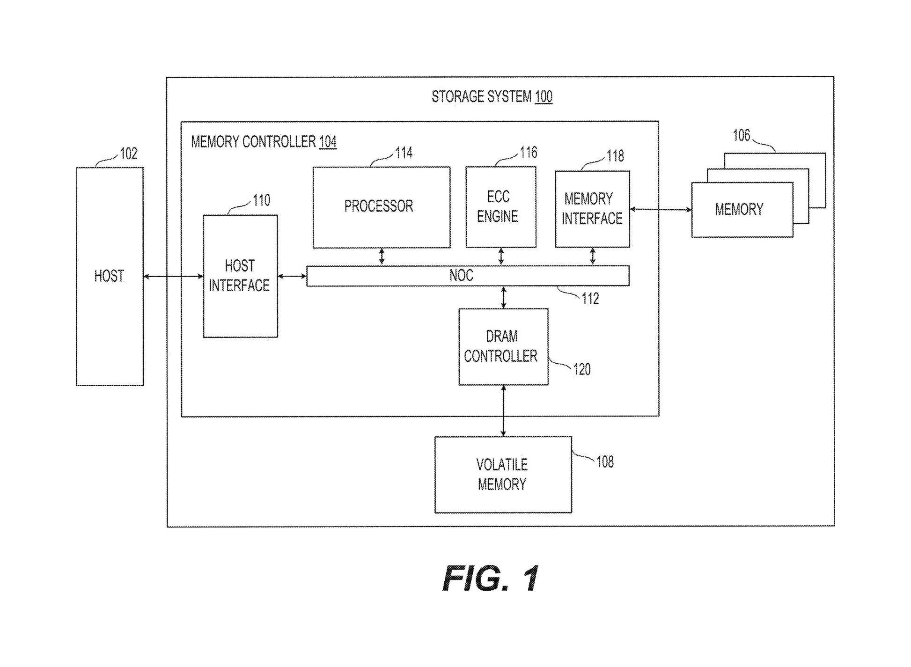

# How Cheap, Slow NAND Reaches HBM's Lane: SanDisk's Recipe for High Bandwidth Flash

*FIG. 1: a conventional storage controller stack. The memory controller (104) routes host traffic through a network-on-chip (112) to the processor (114), ECC engine (116), and memory interface (118), which talks to the non-volatile memory (106). The point of the picture is what it is not: there is no exotic new memory cell here, just NAND flash behind an ordinary controller.*

## The Memory a Large Model Has to Be Fed

A large language model is, in storage terms, a very big file that has to be read very fast. A terabyte or more of weights has to sit in memory and stream back to the processor at a very high data rate, which is why inference today leans on expensive HBM DRAM [0005]. That sets up an obvious temptation. NAND flash costs far less per bit than DRAM, so why not store the weights on flash and read them back?

The patent answers its own temptation in one sentence: NAND is "too low" on bandwidth and "too high" on power "to provide a viable alternative to HBM devices" [0006]. This is the reader's first objection too. Flash is the slow, cheap tier; it is not where you put something you need to read at HBM speed. SanDisk's application, US 2025/0259685 A1, is an argument that the gap can be closed, and it closes it not with one breakthrough but with a stack of ordinary-looking choices that compound.

## How Wide the Gap Actually Is

Put the two memories side by side at the level of a single die, on the patent's own numbers. An HBM DRAM die runs at about 75 GB/s. A conventional NAND die runs at about 4.4 GB/s [0152]. That is the central problem stated as arithmetic: roughly a 17-fold bandwidth deficit per die before power is even discussed. On the energy axis the picture is the same shape. A conventional NAND array spends about 4.5 pJ/bit, several times the budget the application wants to land on [0154].

The deficit is what makes brute force hopeless. You cannot simply buy your way to HBM-class system bandwidth with cheap dies, because the die count explodes. Reaching the target system bandwidth with conventional NAND would, the patent notes, "require a prohibitively large number of memory packages" [0153]. So the question is not whether NAND is cheaper, it plainly is, but whether a NAND die can be re-engineered to deliver something close to an HBM die's bandwidth at a fraction of its energy. The rest of the application is the recipe for doing exactly that, and it is worth following one ingredient at a time.

## The Bandwidth Recipe, One Ingredient at a Time

The application is unusually direct about its method. Bandwidth, it says, is raised three ways: by "increasing the number of memory planes per memory die," by "increasing the number of input/output (I/O) channels per memory die," and by "reducing the physical page size to decrease read latency" [0157]. None of these is a new invention on its own. The move is to apply all three at once and let them multiply.

Walk the planes first. A conventional die in the application's example carries four planes and reads at 4.4 GB/s. Pushing that to thirty-two planes, "eight (8) times the number of planes" [0167], lets eight times as much data come off the die in parallel, lifting the same die to 35.2 GB/s at an unchanged 8 kB page. More planes reading at once is most of the climb.

Then attack latency by shrinking the page. A NAND read latency, tR, is dominated by sensing a page out of the array, so a smaller page senses faster. Halving the page from 8 kB to 4 kB drops tR from 15 microseconds to 4 microseconds and carries the thirty-two-plane die to 66 GB/s [0174]. Halving again to a 2 kB page drops tR to 1.7 microseconds and reaches 77 GB/s per die [0181]. The third ingredient, more I/O channels per die, is the plumbing that keeps the wider, faster array from bottlenecking at its own pins [0157]. The walk is the whole argument: 4.4, then 35.2, then 66, then 77 GB/s, a single die taken to within shouting distance of an HBM die's lane, by stacking choices rather than inventing a new cell.

*FIG. 5: the bandwidth recipe made visual. Four panels walk the same die from four planes at 4.4 GB/s (8 kB page), to thirty-two planes at 35.2 GB/s, to thirty-two planes with a 4 kB page at 66 GB/s and tR of 4 microseconds, to a 2 kB page at 77 GB/s and tR of 1.7 microseconds.*

## Spending Less Energy per Bit

Bandwidth is half the deficit; the other half is power, and the application treats it as a separate recipe. The blunt lever is supply voltage. Current NAND "typically" runs at Vcc of 2.5 V; the application proposes running at 1.2 V [0184], and the internal rails come down with it, the application walking its read and sense voltages down in step (for instance Vread from 4.7 V toward 2.4 V). Energy per operation falls roughly with the square of voltage, so this is where most of the power saving lives.

Dropping the supply that far creates its own problem, which is the clever part. Sensing a NAND cell normally needs headroom that a 1.2 V rail does not leave. The application's answer is a "positive sensing" scheme that sets the source-line voltage to 0 V so the sense operation fits inside the reduced supply [0190]. That is what lets the voltage cut actually stick rather than break sensing. Put the levers together and the array lands at no greater than about 1 pJ/bit, down from the roughly 4.5 pJ/bit baseline [0154]. The reductions in supply and internal voltages are described as design choices for the disclosed embodiment, not as claim limitations, so the right reading is "this is how the application argues the power target is met," not "every HBF part must do precisely this."

## From One Die to a System That Reaches the Lane

A die at 77 GB/s is a result; a memory system at HBM-class bandwidth is the goal, and the application closes that gap by counting packages. Group dies into HBF packages, wire a number of packages to a single processing unit, and the per-die figures roll up. On the application's arithmetic, "each memory package has a bandwidth of 16x66 GB/s = 1.1 TB/s," so "to provide a bandwidth of approximately 3 TB/sec, three (3) memory packages would be required, which is practical" [0175]. The example system it draws is a single GPU in electrical communication with eight HBF packages [0148].

That number is the entire payoff, and it only means anything against the earlier baseline. Conventional NAND needed a prohibitively large package count for the same system bandwidth [0153]; the re-engineered die brings it down to a handful. A practical box, not an impractical one, reaches the lane HBM occupies.

One bound belongs here, stated plainly. The 77 GB/s per die, the roughly three to five packages, the 3 TB/s, and the 1 pJ/bit are the application's own design-target calculations, carried with "about," "at least," and "no greater than" hedging throughout [0007], [0008]. They are worked figures on the application's own arithmetic, not measured silicon or a shipped benchmark, and the HBM and NAND baselines they are weighed against are the application's self-reported numbers rather than independently corroborated ones. The recipe is an argument for how the gap closes, and it should be read as one.

*FIG. 10: the system payoff. A single GPU (1002) sits in electrical communication with eight HBF packages (1004), each built from multiple dies of thirty-two planes. The package count is an example; on the application's math three packages already reach roughly 3 TB/s.*

## The Numbers Are Written Into the Claims

For a reader weighing whether SanDisk has a defensible position rather than just a clever design, the most telling move is where the headline numbers sit. They are not buried in the specification as worked examples. They are lifted into the independent claims as limitations. The application claims a memory system with "a bandwidth during read of at least 2.7 TB/s, and each memory array has a power efficiency of no greater than 1.1 pJ/bit" [0007], tightening in a further claim to "at least 3 TB/s" and "no greater than 1 pJ/bit" [0008].

Writing performance targets into the claims is a deliberate attempt to fence the category: to make "high bandwidth flash at this spec" something a competitor has to design around rather than merely match. It is worth keeping the bound from the last section in view here. This is a published application, US 2025/0259685 A1, not a granted patent, so the claim scope is what SanDisk is asking for, not what it has been awarded. The moat is staked, not yet fenced. What the claim drafting shows is intent: SanDisk is trying to own the number, not just hit it.

## Why the Aggressive Choices Are Safe

Several ingredients in the recipe look reckless for general-purpose flash. Running as SLC throws away density. Driving voltages and threshold-distribution margins down invites read disturb. They are safe here because of what the workload is. For inference, the application observes, the HBF packages "can be considered write once, read many times memory" [0148]: the weights are written once and then read endlessly. Choices that would be wrong for a write-heavy drive are exactly right when programming is rare and reads dominate.

Read-heavy use does raise its own hazard, read disturb, where repeated reads slowly perturb neighbouring cells. The conventional fix is to relocate the data to a fresh block, paying a program-erase cycle and bookkeeping each time. The application instead describes an "in-place read refresh" technique that "eliminates the need to erase memory cells" [0202], refreshing the data where it sits, and a "sub-block read refresh" variant that avoids "the need and unpredictability of locating an alternative block" [0210]. These are presented as embodiments, alternatives the disclosure describes, not independent-claim limitations, so they are best read as how the design proposes to survive read-heavy life rather than as the core of what is claimed.

*FIG. 8: why read-heavy use survives. Panel A shows the conventional response to read disturb, relocating data to a new block and paying a program-erase cost. Panel B shows in-place read refresh, restoring the data where it sits with no relocation.*

## What the Application Is Really Staking

Strip the recipe to its claim and the result is almost unglamorous. There is no new physics here, no novel cell. There is a published argument that if you take ordinary NAND and push planes up, pages down, I/O wider, and voltages lower, all at once and for a workload that only ever reads, a cheap, slow memory lands in an expensive, fast memory's lane. Whether the silicon meets the arithmetic is a question for a datasheet and a granted claim set, neither of which this application is.

It is worth keeping one boundary in mind as the category develops. High bandwidth flash is larger than this one filing: it is a device, a function, a process, and an application that will take more than a single specification to pin down. NAND did not get faster here. It got pointed at one job, and asked to do nothing else well. The recipe is the argument; the arithmetic is the claim; and the number, for now, lives in the claims rather than on a part.

# Sources

## Patents
- US 2025/0259685 A1, "High Bandwidth Nonvolatile Memory Devices," SanDisk Technologies LLC, priority 2024-02-13, published 2025-08-14, inventors: Xiang Yang, Deepanshu Dutta, Yan Li, Masaaki Higashitani.
