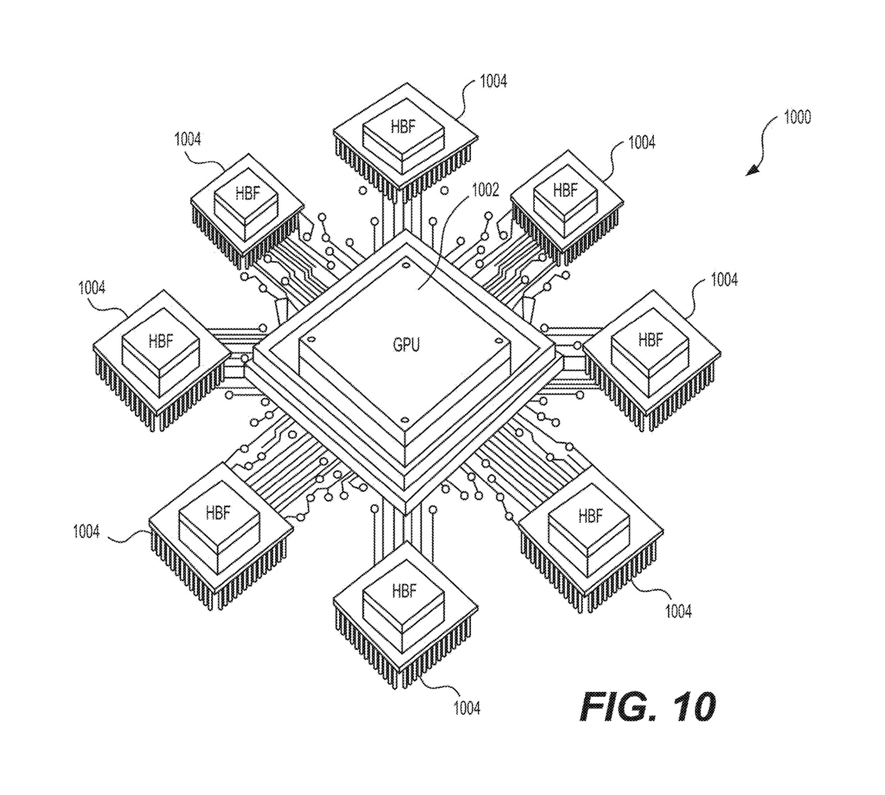

# Does SanDisk Have a Technical Moat in AI Memory?

### A patent's-eye view of High Bandwidth Flash (HBF)

*An investor-oriented read of US Patent Application 2025/0259685 A1, "High Bandwidth Nonvolatile Memory Devices" (SanDisk Technologies LLC).*

---

## The question on the table

For the last three years the entire AI hardware story has had one quiet bottleneck: memory. A GPU is only as fast as the data you can feed it, and the data lives in **High Bandwidth Memory (HBM)** — stacks of DRAM that are fast, power-hungry, capacity-limited, and extraordinarily expensive. SK hynix, Samsung, and Micron own that market, and as of 2025 it was worth roughly $38B and heading toward $58B in 2026.

SanDisk — freshly independent after its February 2025 spin-out from Western Digital, now a pure-play NAND company — is making a bet that there is room beside HBM for a second tier of "AI memory" built from flash instead of DRAM. It calls the category **High Bandwidth Flash (HBF)**. NAND is roughly an order of magnitude cheaper per bit than DRAM and is non-volatile, which is a near-perfect fit for the read-dominated job of holding large-language-model weights. The catch is that ordinary NAND is far too slow and too power-hungry to sit next to a GPU.

The patent in front of us is the company's attempt to plant a flag on the *definition* of HBF — to claim, in effect, "a flash memory system that hits HBM-class bandwidth at flash-class power." For an investor doing technical-moat diligence, that raises the only question that matters:

> **Is this a moat — a defensible, hard-to-replicate position — or is it a marketing number wrapped in a patent application?**

The honest answer is *somewhere in between, and which way it resolves is knowable from a short list of signals.* This memo lays out what the patent actually protects, what's genuinely hard to copy, where the protection is thin, and what to watch.

---

## What the patent actually claims (the legal perimeter)

A patent's moat is its **claims**, not its prose. This application has three independent claims and seventeen dependents. Stripped down:

| Claim | Type | Core limitation |
|---|---|---|
| **1** | Apparatus | A memory system of *multiple dies*, each with non-volatile cells, with **read bandwidth ≥ 2.7 TB/s** and **power efficiency ≤ 1.1 pJ/bit** |
| **2** (dep.) | — | Tightens to **≥ 3 TB/s** and **≤ 1 pJ/bit** |
| **3–8** (dep.) | — | Adds structure: **≥ 32 planes**, two **sub-planes** per plane, **page size ≤ 4 kB / ≤ 2 kB**, **supply ≤ 1.5 V / ≤ 1.2 V** |
| **9** | Computer system | A **single processing unit** + multiple **HBF packages**, combined read bandwidth **≥ 2.7 TB/s**, dies **≤ 1.1 pJ/bit** (this is Fig. 10) |
| **17** | Method | Running an **LLM operation** moving data between HBF packages and the processor at **> 2.7 TB/s** |

Two features of this claim set deserve an investor's attention, because they cut in opposite directions.

**First — and this is the striking part — the headline claims are *performance-defined*.** Claim 1 doesn't protect a specific circuit; it protects an *outcome envelope*: any multi-die system that reads at ≥ 2.7 TB/s while burning ≤ 1.1 pJ/bit. It is so broad that **it doesn't even require NAND** — claim 1 says only "non-volatile memory cells," and the specification expressly lists ReRAM, MRAM, FeRAM, and phase-change memory as alternatives. If granted as written, that is a remarkably wide net: it reads on a competitor's product regardless of *how* they got there.

**Second, the structural dependents (claims 3–8) are where the real engineering lives** — 32 planes, sub-planes, sub-2 kB pages, sub-1.2 V supply. These are narrower but far more defensible, because they describe a specific, hard-won way to actually reach the envelope.

That split — a very broad result-claim sitting on top of narrow structural claims — is the central fact of this patent's moat, and we'll come back to why it's double-edged.

---

## The "how" — what is genuinely hard to copy

A performance number is not a moat; the ability to hit it is. The specification is candid about the recipe, and it's a genuinely non-trivial piece of memory engineering. The patent attacks the two problems — too slow, too hot — on several fronts at once.

**Bandwidth, attacked three ways:**

- **Massive parallelism.** A conventional NAND die has ~4 planes. The patent pushes to **32 planes** that operate independently and simultaneously (Figs. 5B–5D), each further split into **two sub-planes**. That's the single biggest lever: 8× the parallel read engines on one die.
- **Latency by shrinking the page.** Read latency (tR) falls as the physical page gets smaller. The patent walks the page down from 8 kB → 4 kB → 2 kB, and read latency collapses correspondingly: **15 µs → 4 µs → 1.7 µs**. Per-die bandwidth climbs from 4.4 GB/s (conventional) to **35 → 66 → 77 GB/s**.
- **Widening the I/O pipe.** None of that matters if the die can't get bits off-chip, so the I/O count is scaled **8 → 64 → 128 channels** so the interface stops being the bottleneck.

**Power, attacked three ways:**

- **Drop the supply voltage** from the usual 2.5 V to **1.2 V** (power ≈ V × I, so this is leverage).
- **Make 1.2 V actually work.** You can't just lower the rail — sensing breaks. The patent introduces a **"positive sensing" scheme** that pins the source line to 0 V (instead of 1 V), which keeps the required bit-line voltage inside what a 1.2 V supply can deliver. This is the kind of detail that signals real silicon work, not a slide.
- **Cut every internal voltage:** Vread 4.7 → 2.4 V, VDDSA 2.2 → 1.1 V, VBL 0.3 → 0.15 V, sense current 20 → 10 nA.

**Two enabling choices tie it together.** The device runs as **SLC (one bit per cell)** — the fastest possible read mode — and it exploits the fact that LLM weights are *written once and read millions of times*. Because programming is rare, the cell's voltage distributions can be made unusually narrow, which is what *lets* you drop Vread and tighten margins. And the whole thing is built as a **bonded two-die assembly** (Fig. 2B): the NAND array on one die, all the CMOS control/sense/I/O logic on a separate die bonded to it. That "CMOS-bonded-array" approach is what frees up the die area to host 128 I/O channels and 32 planes' worth of sense amps in the first place.

The result, in the patent's own arithmetic: where a single HBM DRAM die does ~75 GB/s and a conventional NAND die does ~4.4 GB/s, the HBF die reaches 35–77 GB/s, and a handful of packages (the system in Fig. 10 shows eight around one GPU) reach the ~3 TB/s system target.

> 
>
> **Fig. 10:** the system-level vision claimed in claim 9 — a single processing unit fed by a ring of HBF packages.

**The diligence point:** most of these techniques are *individually* known to the NAND industry (multi-plane operation, page-size/latency trade-offs, die-to-die bonding, low-voltage operation, SLC). The novelty — and therefore the defensibility — rests on the *specific combination tuned to a specific operating point*, plus the manufacturing know-how to yield it. That know-how is real, but it is not, by itself, exclusive to SanDisk.

---

## One patent is not a moat — the portfolio is

No serious moat rests on a single document, and this one shouldn't be read alone. Tellingly, the specification describes techniques that **aren't in these 20 claims** — notably two read-disturb fixes ("in-place read refresh" and "sub-block read refresh," Figs. 8–9) that let the device survive the punishing read traffic of inference *without* the endurance cost of relocating data. Those are described here but claimed elsewhere in the family.

That is the signal that matters: this is the **definitional** patent in a deliberately **layered portfolio**, all from the same core inventor team (Yang, Dutta, Li, Higashitani):

- **Definition / headline spec** — this patent (and its Korean and PCT siblings).
- **Function** — companion filings on the read path (e.g., always-on bit line, discharge-free read).
- **Process** — separate filings on how to *manufacture* HBF.
- **Integration & application** — processor-plus-bonded-array integration and downstream AI use cases.

A thicket like this is a much stronger moat than any one claim, because a competitor has to design around *all* the layers — definition, the circuit tricks, the process, and the system integration — not just one number. For an investor, **the family is the asset; this patent is the cover page.**

---

## The competitive frame — what this is defending against

HBF is not trying to kill HBM; it's trying to sit beside it. The pitch is that a GPU gets a small amount of ultra-fast HBM plus a *large, cheap, non-volatile* pool of HBF for the model weights — augmenting HBM's limited capacity rather than replacing it. That framing matters for the moat, because it determines who the adversaries are:

- **The incumbents** (SK hynix ~50–60% of HBM, Samsung, Micron) are racing on HBM4 (~2 TB/s per stack, shipping 2025–2026). They are not standing still, and — critically — **Samsung and SK hynix also make NAND.** Anyone who can build HBM can attempt to build high-bandwidth NAND.
- **The standard.** In August 2025 SanDisk signed an MOU with **SK hynix** — the HBM market leader — to **standardize HBF**, and in February 2026 the two kicked off a standardization consortium under the Open Compute Project. SanDisk targets first HBF samples in 2H 2026 and first AI-inference devices in early 2027.

That standardization move is the strategic crux, and it is genuinely double-edged for the moat (more below).

---

## The bull case: why the moat could be real

1. **Category definition + foundational IP.** Being first to define "HBF = this performance envelope" *and* holding broad claims on it is the strongest possible position — *if* the claims survive. A foundational, possibly standard-essential patent is a toll road, not a fence.
2. **A layered family, not a lone claim.** Definition + circuit + process + integration forces a competitor to climb several walls.
3. **Standardization leadership.** Writing the standard, with the HBM #1 as a partner, converts first-mover status into ecosystem pull and raises the odds that compliant devices read on SanDisk's claims.
4. **Process know-how is sticky.** Low-voltage SLC NAND with 32 planes, 128 I/O, positive sensing, and die bonding at yield is hard to replicate quickly even with the patent in hand.
5. **Aligned incentives.** Post-spin, HBF is a flagship bet for a focused pure-play, not a side project inside a larger company.

---

## The bear case: why to discount it

1. **It is an application, not a granted patent.** Published August 2025 off a February 2024 provisional, these claims have not been through examination. Broad result-claims like claim 1 are exactly the kind that **narrow during prosecution** — assume the granted scope is smaller than what's written today.
2. **Performance-defined claims are fragile.** A pure "≥ 2.7 TB/s at ≤ 1.1 pJ/bit" limitation invites validity challenges (enablement, obviousness) and is **hard to enforce**: proving infringement may require measuring a competitor's internal pJ/bit. Courts are often skeptical of claims that read like "we claim the number."
3. **Standardization cuts both ways.** A standard, by design, **invites multiple suppliers** — including SK hynix itself. If HBF succeeds as a standard, SanDisk likely won't be the sole maker; the moat shifts from *exclusivity* to *licensing royalties + cost/yield leadership*. That can still be lucrative (the HBM and SSD precedents show it), but it's a different, thinner moat than a monopoly.
4. **The incumbents can answer.** Samsung, SK hynix, and Micron own enormous NAND and HBM patent estates and fabs. They can build competing high-bandwidth NAND, push HBM4E/capacity, or design around the specific structural claims.
5. **Category risk is still live.** The specs are *targets* — the patent carefully says "about," "at least," "no greater than." Nothing has been shipped or independently benchmarked; first samples are a 2H-2026 event and real adoption depends on GPU-side interface support that doesn't exist yet.

---

## What to watch (the diligence checklist)

The moat thesis is **testable**. These are the signals that will harden or puncture it, roughly in order of importance:

- [ ] **Granted claims.** Track this application and its siblings to allowance. *How much* does claim 1 narrow? Do the structural claims (32-plane / sub-2 kB / sub-1.2 V) survive intact? Granted, narrow-but-defended structural claims are worth more than a broad-but-rejected number.
- [ ] **Standard-essentiality.** Does the OCP/JEDEC HBF spec end up reading on SanDisk's claims? A declared SEP changes the economics entirely.
- [ ] **Family depth and geography.** Continued filings, and coverage across US / KR / PCT / CN / TW, signal a real estate rather than a one-off.
- [ ] **Silicon vs. spec.** Do the 2H-2026 samples actually hit ~3 TB/s / ~1 pJ/bit? Target numbers in a patent are not shipping benchmarks.
- [ ] **Customer design-ins.** A hyperscaler or GPU-vendor commitment is the difference between a standard on paper and a market.
- [ ] **Competitor patent activity.** Watch Samsung / SK hynix / Micron filings in high-bandwidth NAND — both as a threat and as validation that the category is real.

---

## Verdict

**This patent is a stake in the ground, not a fortress.** Read alone, it is broad, category-defining, and genuinely clever about *how* to push NAND into HBM territory — but it is also ungranted and, at its broadest, shaped like a performance number, which is the most contestable kind of claim there is.

The defensible moat thesis does **not** rest on this single document. It rests on three things the document points to: **(1)** the layered patent *family* that forces competitors to design around definition, circuit, process, *and* integration; **(2)** the hard-to-replicate **manufacturing know-how** of low-voltage, many-plane SLC NAND on bonded dies; and **(3)** the **standardization leadership** that could convert first-mover status into either standard-essential IP or durable cost/yield advantage.

So, for the investor's binary question — *does the company have a technical moat?* — the calibrated answer is:

> **A credible, above-average moat in ambition and engineering substance, but one that is currently contingent in law and unproven in silicon.** It hardens into a real moat if the structural claims grant cleanly, the family reads on the eventual standard, and the 2026 samples hit their numbers. It thins toward a mere head-start if claim 1 collapses in prosecution, the standard commoditizes supply, or the incumbents ship competitive high-bandwidth NAND first.

The good news for diligence is that all three forks are observable on a 12–24 month horizon. This is a moat you can *watch close or open*, rather than one you have to take on faith.

---

### Methodology & sources

**Primary source (authoritative).** US Patent Application Publication **US 2025/0259685 A1**, "High Bandwidth Nonvolatile Memory Devices," SanDisk Technologies LLC; inventors Yang, Dutta, Li, Higashitani; filed May 10, 2024 (provisional 63/552,772, Feb 13, 2024); published Aug 14, 2025. All claim language, performance figures (bandwidth, pJ/bit, voltages, plane/page/I/O counts), and architecture (Figs. 1, 2B, 5B–5D, 10) are drawn directly from this document. The uploaded materials also included a Korean-language brief for a sibling national-phase filing in the same family; it is consistent with the US document, which I treat as the primary citable source because it carries the full specification and granted-format claims.

**Guardrails.** This is a *published application, not a granted patent* — claim scope may change. The performance figures are specification **targets** (the patent uses "about," "at least," "no greater than"), not shipped, independently verified benchmarks. Comparisons to HBM use the patent's own stated numbers plus the dated external context below; none should be read as a claim that HBF has been proven superior to HBM in production.

**External market context (dated, for framing only — verify before relying):**
- SanDisk / SK hynix HBF standardization MOU (Aug 6, 2025) and OCP consortium kickoff (Feb 25, 2026); sample/device timeline (2H 2026 / early 2027) — [Sandisk newsroom](https://www.sandisk.com/company/newsroom/press-releases/2025/2025-08-06-sandisk-to-collaborate-with-sk-hynix-to-drive-standardization-of-high-bandwidth-flash-memory-technology), [SK hynix newsroom](https://news.skhynix.com/sk-hynix-and-sandisk-begin-global-standardization-ofnext-generation-memory-hbf/), [Blocks & Files](https://www.blocksandfiles.com/ai-ml/2025/08/07/sandisk-and-sk-hynix-working-to-standardize-high-bandwidth-flash/1587711).
- SanDisk spin-out from Western Digital finalized Feb 24, 2025 (pure-play NAND) — [Western Digital 8-K](https://www.sec.gov/Archives/edgar/data/0000106040/000119312525019294/d922460dex991.htm).
- HBM market size and share (SK hynix ~50–60%, Samsung, Micron; HBM4 ~2 TB/s/stack; ~$38B→$58B 2025→2026) — [Astute Group](https://www.astutegroup.com/news/general/sk-hynix-holds-62-of-hbm-micron-overtakes-samsung-2026-battle-pivots-to-hbm4/), [Introl](https://introl.com/blog/hbm-evolution-hbm3-hbm3e-hbm4-memory-ai-gpu-2025).
