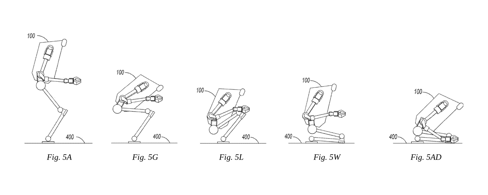

# Agility Robotics' Moat Is The Safe Stop, Not The Walk

*FIG. 5A-5AD, the reconfiguration in the patent's four phases [0046]: 5A (standing start), then 5G, 5L, 5W, 5AD as the robot bends and tilts forward, balances deeper over its thighs, drops its knees to the ground, and brings its hands down to a compact kneel. One embodiment of the locked step. Claim 1 requires lowering a center-of-gravity, not this exact choreography.*

Agility Robotics is about to be a public company, and the story it sells to investors is that a two-legged robot can work in the same aisle as a person and be trusted there. The merger that takes it public values it at about $2.5 billion. That premise, not walking speed or payload, is what the valuation rests on. So the question a diligence file should ask is narrow: when a humanoid has to stop because a person got too close, what does Agility own that a competitor does not? US 12,560,948 B2, granted in February 2026, is the cleanest answer the company has put on the public record. It does not patent walking. It patents how the robot comes to rest.

## What The Body Forces

Start with the shape, because the shape creates the problem (Fig. 1). A bipedal robot is "always falling to some degree during normal operation" [0010]. It stays upright only by constant active control, which means the moment it loses power or faults, "it collapses" [0010]. That single fact breaks the standard factory safety answer. For a hundred years the way to make a machine safe has been a button that cuts the power. Do that to a humanoid and you have not stopped a hazard, you have created one: a cut-power humanoid falls. The filing makes the irony explicit, noting that the most dangerous moment can be the human reaching in to hit the disable switch [0011].

The other classic answer is a cage. Put the robot behind a fence and segregation keeps people safe. But segregation "greatly reduce[s] the productive potential of dynamically stable robots" [0013], and for a humanoid that destroys the entire reason to buy one instead of a conveyor or a wheeled cart. A caged humanoid is an expensive way to do what cheaper machines already do.

So the company is boxed in. Cut the power and it falls on someone. Cage it and it earns nothing. The patent steps into exactly that gap.

## What Claim 1 Locks

The independent claim describes a single timed sequence rather than a single stop.

> A method comprising: determining ... first hazard information about a human in the environment at a first time, wherein the first hazard information indicates a first level of risk of collision between the mobile robot and the human; decelerating the mobile robot ...; determining ... second hazard information about the human at a second time after the first time, ... wherein the second level of risk is greater than the first level of risk; determining ... clearance information about a portion of the environment around the mobile robot after decelerating the mobile robot; and reconfiguring the mobile robot based at least partially on the second hazard information and the clearance information, wherein reconfiguring the mobile robot includes lowering a center-of-gravity of the mobile robot.
> US 12,560,948 B2, claim 1

Read what that actually requires. Risk is measured over time and has to be rising, with the second reading greater than the first. The robot first slows in a way it can reverse. Before it does anything more committal, it checks the space around itself, the clearance information [0027]. Only then does it reconfigure, and the reconfiguration has to lower the robot's center-of-gravity [0028].

The protected idea is not the word "stop." It is the graduated move from a cheap, reversible slow-down to a surroundings-aware posture change that drops the robot low as the danger climbs. Fig. 3 is that logic drawn out, from "should I decelerate?" through "is it safe to reconfigure?" to a final safe operating stop, with hold-and-watch states at each rung.

*FIG. 3, [0033]: the escalation the claim locks, including the clearance check that gates the reconfiguration.*

## Locked, Open, And Pinned

A moat is only as wide as what the independent claim requires, so it is worth separating that from the parts of the filing that are optional. This is where most patent readings go wrong, by crediting the claim with everything the description happens to mention.

**Locked.** Claim 1 requires the timed, rising-risk sequence above: two hazard readings with the second higher than the first, a clearance check after decelerating, and a reconfiguration driven by both that hazard reading and the clearance, where the reconfiguration lowers the center-of-gravity. Take away any one of those and you are outside the claim.

**Open.** Almost everything an onlooker would point to is in the dependent claims or the description, not in claim 1. The specific kneel in Fig. 6 is one example of lowering the center-of-gravity, not a requirement, and the patent walks that fold frame by frame across FIG. 5. So are crouching, sitting, the standing-to-non-standing move (claim 19), the knee bend and torso tilt, the safe operating stop with a trained-operator release [0031], the machine-learning hazard model that names YOLOv8 and Amazon Rekognition [0024], and placing a carried tote on the floor on the way down (claim 20). These widen the fence across many concrete behaviors, which is good drafting, but a competitor avoids them one at a time without touching the core.

**Pinned.** A few numbers are example points, not guarantees. The fall-extent reduction "by at least 30%, by at least 50%" [0029] is pinned only as far as claim 13 commits it, and the decision loop rates such as 1 Hz or 10 Hz are illustrative. None of that should be read as a bound the independent claim states.

*FIG. 6, [0047]: the kneel is one open embodiment of the locked instruction to lower the center-of-gravity, a compact pose that collapses predictably on a fault.*

## How Wide Is The Moat

The useful test is whether a competitor can get the same safety result without practicing claim 1. There are three obvious escape routes, and each one walks straight back into the problem the filing describes. Drop the clearance check and the robot can reconfigure into a shelf or a person behind it. Refuse to lower the center-of-gravity and just freeze standing, and a later fault still topples a tall mass from full height. Collapse the rising-risk escalation into one stop threshold and the robot either over-reacts and parks itself constantly, which is the productivity loss that made cages unattractive [0013], or it under-reacts.

The filing even spells out why a reconfiguration can be the wrong call at a blind corner or against a running person, where there is no time and standing still is safer [0033]. The claim is not an arbitrary lock on one behavior. It tracks the physics, which means most ways around it produce a worse robot.

Two features push the fence wider. The claim is written so "bipedal" can be read as "mobile," reaching wheeled dynamically stable robots and forms with one arm or more than two [0015], which closes the "we are not a biped" exit a wheeled-humanoid rival might try. And the behavior is anchored to recognized industrial safety practice: the filing frames its stops as "protective and controlled forms of Category-1 and Category-2 stops" [0041], the controlled-stop categories that workplace standards already speak in. A claim drafted in the language of the safety standard is a claim aimed at the exact capability a buyer's safety team has to sign off on.

## Why It Matters Now

The patent's own motivation is commercial, not academic. The background points at order-fulfillment work and a forecast "shortage of a million or more workers" over the next ten to fifteen years [0002]. The invention exists to let a robot take that work in a shared space rather than a cage. That is the same capability the company's market story now depends on.

The following context sits outside the filing and comes from public reporting, not the patent. Agility has agreed to go public through a merger with Churchill Capital Corp XI at a valuation of about $2.5 billion, expected to trade on Nasdaq as AGLT around the end of 2026 with roughly $620 million in cash, part of it from a Foxconn-led group.

Its Digit robot is already in paid commercial use, most visibly under a multi-year agreement with the logistics operator GXO, where Agility reports it has moved more than 100,000 totes, with other customers including Schaeffler, Toyota Motor Manufacturing Canada, and Mercado Libre. None of that is inside the patent, and the patent does not prove any of it. What the patent does is show that the safety capability underneath the deployment story is something Agility is actively claiming as its own, at the moment it asks public investors to underwrite that story.

## What This Patent Does Not Do

Honesty about the limits is what makes the rest credible. Every one of the 20 claims is a method claim. A method claim protects the act of performing the steps, which fits a behavior well, but it is generally harder to detect and to enforce than a claim on a device, because you have to show the accused robot actually runs the sequence. There is also a single independent claim, so the independent protection has one validity target rather than several. If claim 1 were knocked out, the dependents survive only as narrower fallbacks.

The field is also crowded. The examiner allowed this filing over directly adjacent work, including a 2021 framework for safe deployment of humanoid robots, a 2007 method for an emergent walking stop, and a 2016 falling-protection method using arm compliance. Clearing that art is a real positive signal about novelty of the specific combination. It is not evidence of a category lock. The filing's own list of cited references runs to dozens of adjacent patents and applications, which is what a crowded field looks like.

The patent has no forward citations yet, which is expected for something this new but means there is no market signal about how foundational it will prove. And the usual caveat holds with force here: a patent is not a product or a safety certification, owning the method is not proof that Digit executes it well, and an 18-month publication delay means the company's freshest filings are not yet visible. This read is a technical and strategic one, not a legal opinion on claim validity or freedom to operate.

## The Investor Read

The verdict is yes. This is a real technical moat over the one capability that turns a humanoid from a caged demo into a coworker a safety officer will approve, and that capability gates the revenue the valuation already assumes. It holds for a durable reason: the claim sits on the physics of the problem, so the cheap ways around it tend to produce a more dangerous or less productive robot, and its reach into wheeled forms and into the language of industrial stop standards is deliberate fence-building.

The boundaries are the ones set out above, and they scope the moat rather than cancel it. It is one independent method claim in a contested field, and a granted method is not yet a shipping, certified behavior. What it is not is a single patent that locks the whole humanoid market, and nobody should price it as one.

For an AGLT diligence file, treat US 12,560,948 B2 as strong evidence that Agility is focused on the revenue-gating problem and is competent at fencing it. Then watch three things over the next year. The first is whether the co-pending family and PCT application yield any device or system claims, which would be easier to detect and enforce than today's method claims. The second is whether later patents start to cite this one. The third is whether the graduated safe-stop behavior shows up in real deployments and in third-party safety certification.

The walk gets the demos. The safe stop is what gets the robot into the building, and that is the part Agility has moved to own.

# Sources

## Patents

- US 12,560,948 B2, "Escalating hazard-response of dynamically stable mobile robot in a collaborative environment and related technology," Agility Robotics, Inc., priority 2024-03-01, granted 2026-02-24, inventors: Kevin Reese, Andrew Abate, Tianyao Chen, Jay Jasper, Ezm Masoud, Brian Kirby, Melonee Wise, Prasanna Velagapudi, Ryan Domres, Todd Lewis, Matteo Parigi Polverini, Yves Georgy Daoud.

## Papers

- Scianca, Nicola, et al. (2021). "A behavior-based framework for safe deployment of humanoid robots."
- Takubo, T., et al. (2007). "Emergent walking stop using 3-D ZMP modification criteria map for humanoid robot."
- Zhou, Yuhang, et al. (2016). "Falling protective method for humanoid robots using arm compliance to reduce damage."

## Official statements

- GXO Logistics, "GXO Signs Industry-First Multi-Year Agreement with Agility Robotics," https://gxo.com/news_article/gxo-signs-industry-first-multi-year-agreement-with-agility-robotics/

## News & media

- GeekWire, "'Digit' maker Agility Robotics to go public in $2.5B deal," 2026, https://www.geekwire.com/2026/digit-maker-agility-robotics-to-go-public-in-2-5b-deal-heres-what-the-filings-say-about-its-finances/
- Robotics & Automation News, "Agility Robotics' Digit humanoid passes 100,000-tote milestone in live GXO implementation," 2025, https://roboticsandautomationnews.com/2025/11/24/agility-robotics-digit-humanoid-passes-100000-tote-milestone-in-live-gxo-implementation/96877/

