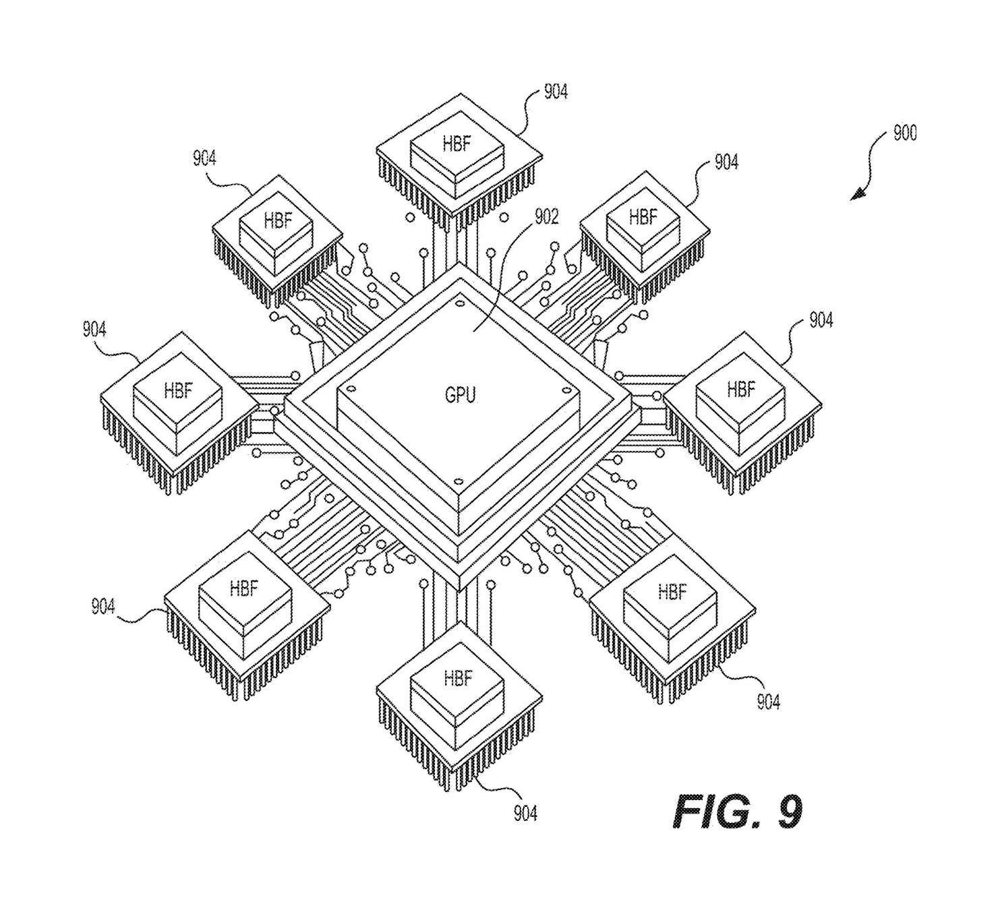
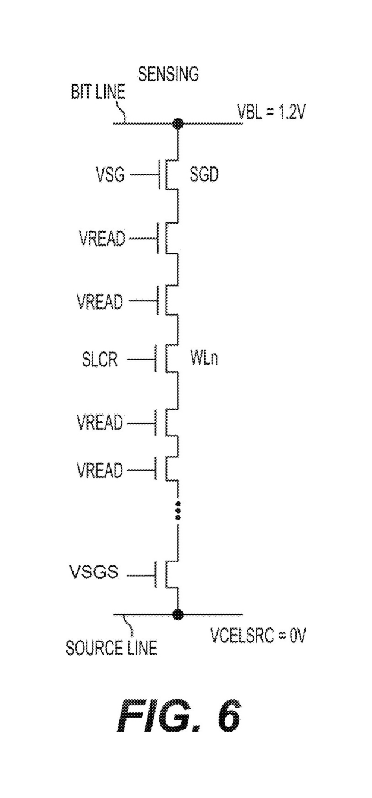
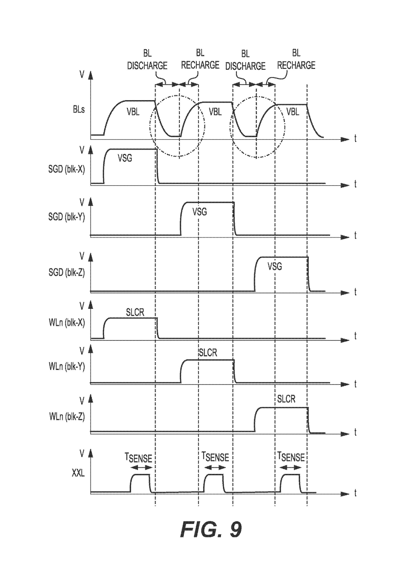
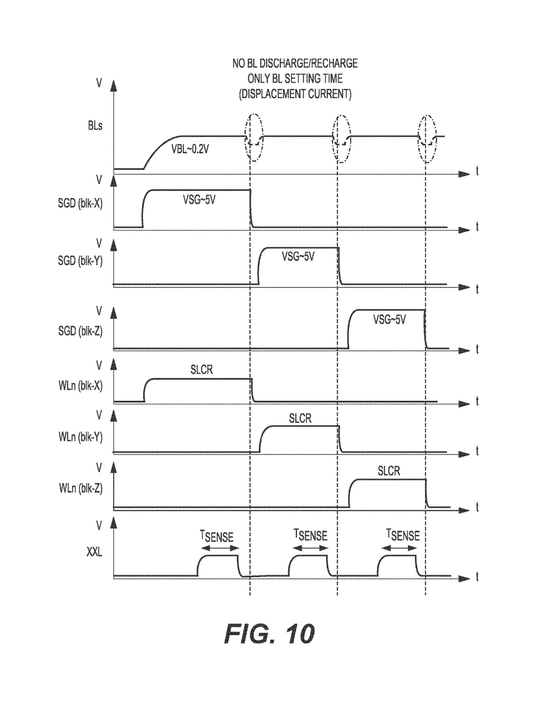
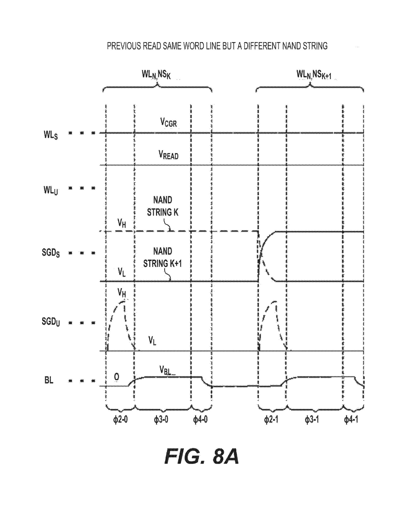
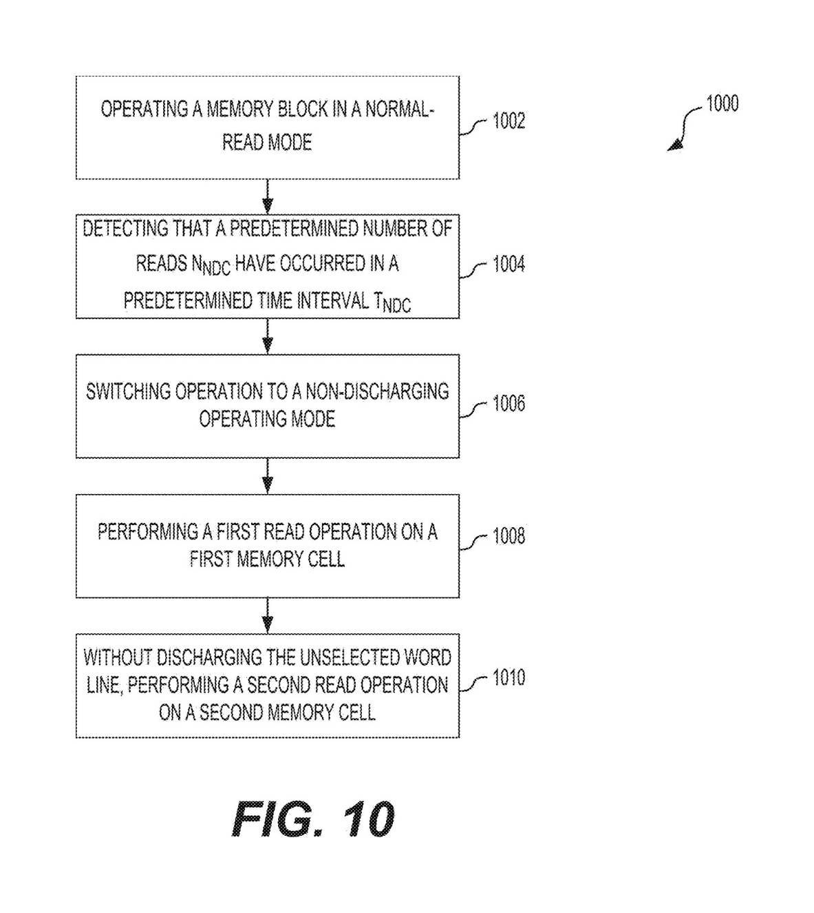

# Always On, Never Discharged: How SanDisk Wants NAND to Read Like HBM

An AI accelerator running a large model has to read the same enormous pile of numbers, the model's weights, over and over, as fast as the chip can take them [0004]. For that job the industry has one default answer: high bandwidth memory, the stacked DRAM known as HBM. It is fast, it is volatile, and right now it is the most supply-constrained part of the entire AI stack.

NAND flash is the opposite. It is cheap and it is permanent, and as one of these SanDisk filings puts it, "the bandwidth of conventional NAND memory devices is too low, and the power consumption of conventional NAND memory devices is too high to provide a viable alternative to HBM devices" [0005].

Two SanDisk applications, filed within about six weeks of each other in 2024, argue that the second half of that sentence was never really about the flash. It was about a habit. **Conventional NAND spends time on every single read raising voltages across the array and then lowering them again, and the trick is to simply stop lowering them.** No new memory cell. No exotic process. Just a refusal to put the array back to sleep between reads.

*Figure 1. The arrangement the read path is built for: a processor surrounded by high bandwidth flash packages. The '143 application describes systems with "a plurality of high bandwidth flash packages in electrical communication with the processing unit" [0019].*

## The string, and the two voltages that cost time

To see what SanDisk is removing, you need one picture of how a NAND read works. Memory cells sit on tall vertical strings, and reading one cell means running a small current down its string and measuring it. Two sets of wires control that current. The bit line is the column that carries the sense current at the top of the string. The word lines are the rows, the stacked control gates running along it. The cell you want sits on one selected word line. Every other cell on the string sits on an unselected word line and has to be forced fully conductive so it does not block the measurement.

The patent does that by holding the unselected word lines at a read pass voltage, which "makes the memory cells of the unselected word lines conductive to electrons whether they are in the erased data state Er or the programmed data state P" [0146].

So every read raises two kinds of voltage: the bit line on the column, and the read pass voltage on the rows. Conventionally, when the read finishes, both come back down. Then the next read raises them again. That charge, discharge, recharge cycle is dead time, and for a workload that does nothing but read all day, that dead time is most of the time.

*Figure 2. One NAND string. The bit line (the column) carries the sense current; the selected word line reads a single cell while the unselected word lines (the rows) are held at read pass voltage so they conduct. From the '143 application, [0146].*

## The column trick: always-on bit lines

The first application, the one built around always-on bit lines, takes the column. Instead of discharging the bit lines after a read, it holds them at a low positive voltage and performs the next read with them still there. The claim language is almost aggressively plain: read a block while the bit lines are held above zero volts, and then, "without ramping the plurality of bit lines down from the elevated voltage," read a different block [0006].

How low, and how steady? In the worked example the bit line voltage sits at about 0.2 volts, and "the voltages of the bit lines BLs never fall by more than 25% from VBL during or between read operations" [0147]. Holding them there means the discharge and recharge time is "eliminated," which is the entire point [0147]. Between reads there is only a brief settling blip, on the order of "less than 1 microseconds," instead of a full collapse and rebuild [0148]. Run that loop across block after block and, in the filing's own words, the bit lines "can be considered to be 'always on'" [0148].

*Figure 3. The cost being removed. In a conventional read the bit line trace drops to discharge and then recharges before each block's read. The '885 application shows this as its baseline.*

*Figure 4. The same three reads with the bit lines held flat at about 0.2 volts. The only motion between reads is a small settling blip, not a discharge and a recharge. From the '885 application, [0148].*

## The row trick, and the part that is actually clever

The second application takes the other axis. Same idea, rotated ninety degrees: keep the unselected word lines at their read pass voltage and do not discharge them between reads. Its summary names the mode a "non-discharging read," in which the unselected word lines "remain biased at a read pass voltage VREAD and are not discharged between successive read operations" [0047]. The abstract is blunt that the word lines stay "not discharged and remain biased to the read pass voltage during and between the first read operation and the second read operation" [0007].

The payoff is stated as a plain causal chain: skip the discharge, shorten the gap between reads, and "the bandwidth of the HBF memory device is increased" [0179].

Put the two filings side by side and you have the same move on both electrode axes of the array. Columns held by one, rows held by the other. That symmetry is the real disclosure here, and it is why these read like a pair rather than two unrelated tweaks.

*Figure 5. The row-axis counterpart to Figure 4. Across two successive reads the unselected word lines hold flat at read pass voltage and never discharge; only the selected line and the bit line move. From the '143 application, [0178].*

There is one more wrinkle, and it is the part that should interest anyone trying to size up how defensible this is. Holding the array up is not free. It costs idle power and it can stress the cells, so doing it constantly would be a bad trade.

The '143 application does not leave it always on. The device starts in an ordinary discharging mode, watches its own traffic, and only once it has "detected that a predetermined number of reads" within a set interval does it switch "to the non-discharging read operating mode" [0181]. In other words, it waits until it is being hammered with reads, which is exactly the HBF workload, and sheds the recovery tax only for the duration of the burst.

*Figure 6. The mode is triggered, not constant. The device runs normal reads, detects a burst of reads inside a time window, and then switches into the non-discharging mode. From the '143 application, [0181].*

## So is there a moat?

Here is where an investor should slow down, because the honest answer is mixed.

Start with the bad news for any moat story. Each of these is a narrow claim. The independent claims describe a device operation: hold a voltage, and do not lower it between reads. A competitor avoids the claim the moment it is willing to lower the voltage. The catch is that lowering the voltage is precisely the performance loss the patents exist to delete, so designing around them means handing back the speed. That is real protection, but it is the soft kind. It does not fence off fast NAND reads in general; it taxes one specific, efficient way of getting there.

What makes the picture more interesting is everything around the single claim. The two filings are not one trick but the same trick on both axes, from the same SanDisk read team. The inventor names Yang, Cao, and Dutta carry across both. The '143 application adds the adaptive trigger, which is harder to wave away as obvious than a static decision to leave the array on.

And the claims do not stop at one chip. They reach up to "a plurality of high bandwidth flash packages in electrical communication with the processing unit" [0019] and, in the companion filing, to systems of at least four such devices around a processor [0011]. These are claims written around an accelerator, not around a memory chip in isolation.

None of that sits in a vacuum, and this next part is not inside the filings. SanDisk is newly independent: Western Digital completed the spin-off in February 2025, and SanDisk now trades on Nasdaq as SNDK.

That same month it began publicly pitching a product it calls High Bandwidth Flash, a NAND-based memory aimed squarely at AI inference, which it claims can reach HBM-class bandwidth at up to eight to sixteen times the capacity of HBM at similar cost. It has stood up a technical advisory board chaired by David Patterson, signed a memorandum with SK hynix to standardize the format, and launched that effort jointly in early 2026, with first samples on a roadmap for the second half of 2026 and inference systems targeted for 2027.

The reason any of this matters: HBM has been effectively sold out through 2026, and its supply is one of the hardest limits on the whole AI build-out.

The two patents never say the words "the product." They describe read techniques. But they describe them in HBF's own vocabulary, high bandwidth flash packages arranged around a processor, and they solve exactly the problem, read bandwidth and read power, that stands between cheap NAND and the HBM socket.

The fair reading is that the moat is not any single one of these claims. It is the combination, both axes plus an adaptive controller, sitting underneath a standardization push with a named partner and a public roadmap. A patent is a fence. What SanDisk is staking out here is closer to a head start on a particular way of reading flash, with the fences planted around the most efficient path through it.

Two cautions belong in front of an investor the whole time. First, both of these are published applications, not granted patents, so the claims that finally issue may be narrower than the ones quoted above. Second, the capacity and bandwidth figures attached to High Bandwidth Flash are SanDisk's own, not independent benchmarks, and they move with each generation.

## Built to be read

Step back and the two filings describe a philosophy more than a feature. DRAM earns its bandwidth by being quick to write and quick to read. Flash has never been quick to write, and SanDisk is not pretending otherwise. What these patents optimize is the one thing an inference accelerator actually does to its weights once they are loaded: read them, relentlessly, without ever changing them. This is memory allowed to stay awake because it is never asked to do anything but read.

Three things are worth watching from here. Whether the claims survive examination close to their current breadth. Whether more read-path filings issue from the same team. And whether, across 2026 and 2027, any of this turns up inside a shipping accelerator rather than on a slide.

The pitch is a new kind of memory. But the patents are about refusing to let the old kind rest.

# Sources

## Patents

- US20250322885A1, "A High Bandwidth Memory Device With Always On Bit Lines," SanDisk Technologies LLC, priorited 2024-04-15, published 2025-10-16, inventors: Xiang Yang, Wei Cao, Deepanshu Dutta.
- US20250279143A1, "Discharge-Free Read Operations for High Bandwidth Nonvolatile Memory Devices," SanDisk Technologies LLC, priorited 2024-03-04, published 2025-09-04, inventors: Wei Cao, Xiang Yang, Jiahui Yuan, Deepanshu Dutta, Richard New.

## Official statements

- SanDisk Investor Relations, "Sandisk Celebrates Nasdaq Listing After Completing Separation from Western Digital," 2025-02-24.
- SanDisk, "Sandisk to Collaborate with SK hynix to Drive Standardization of High Bandwidth Flash Memory Technology," 2025-08-06.
- SK hynix Newsroom, "SK hynix and Sandisk Begin Global Standardization of Next-Generation Memory HBF," 2026-02-25.
- Western Digital Corporation, Form 8-K, U.S. Securities and Exchange Commission, 2025-02.

## News & media

- Tom's Hardware, "SanDisk and SK hynix join forces to standardize High-Bandwidth Flash memory," 2025-08.
- Blocks & Files, "Tech advisory board to plot way forward for SanDisk's High Bandwidth Flash," 2025-07-25.
- TrendForce, "SK hynix, Samsung, and SanDisk bet on HBF, the next battleground in the memory sector," 2025-11-11.
- Bloomberg, "SK Hynix Posts Record Profit After AI Boom Fuels Chip Demand," 2025-10-28.
